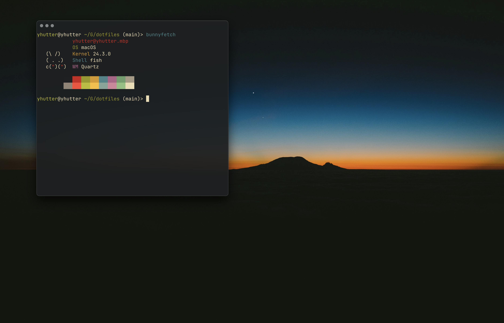

<div class="center">
    <h1>Dotfiles</h1>
    
</div>


## Command Line Tools

> Please note that for this setup assumes that you have [Homebrew](https://brew.sh/) installed on MacOS. For other operating systems use your dedicated package manager to install these packages.

```bash
brew install fish # Shell
brew install bat # Improved version of cat command
brew install zoxide # Improved version of cd that remembers your visited directories
brew install fzf # Fuzzy File Finder
brew install fd # Find Files in your File System
brew install yazi # Terminal based file browser 
brew install ripgrep # Faster grep alternative
brew install lazygit # Terminal Git Client
brew install jq # A lightweight command line tool for JSON Data
brew install --cask font-jetbrains-mono-nerd-font
```
## Tools
- `Neovim` for text editing
- `Ghostty` as my main terminal

## Colorscheme
I use the `Gruvbox Dark` color scheme 
- [Neovim](https://github.com/ellisonleao/gruvbox.nvim)

## Wallpaper
The Wallpaper can be found [here](https://gruvbox-wallpapers.pages.dev/wallpapers/photography/elliott-engelmann-DjlKxYFJlTc.jpg).

## Setup
- Copy the folders into `$HOME/.config`. 
