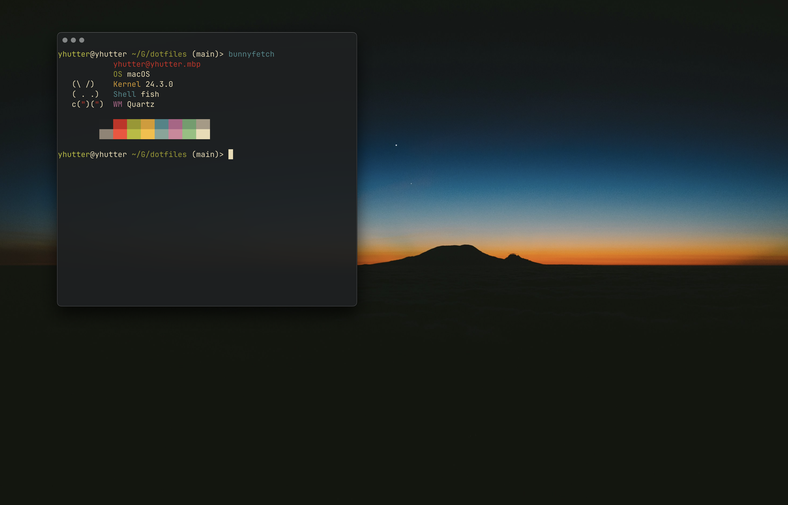

<div class="center">
    <h1>Dotfiles</h1>
    
    <p>
        My personal dotfiles that I have gathered over time. It is just a collection of tools and configs I personally find useful. Please note that my primary system is currently <b>MacOS</b> but I try to keep the instructions as OS independent as I can.
    </p>
</div>


## Command Line Tools

> Please note that for this setup assumes that you have [Homebrew](https://brew.sh/) installed on MacOS

```bash
brew install kitty # Terminal
brew install fish # Shell
brew install vim # Text Editor
brew install bat # Improved version of cat command
brew install zoxide # Improved version of cd that remembers your visited directories
brew install fzf # Fuzzy File Finder
brew install fd # Find Files in your File System
brew install ripgrep # Faster grep alternative
brew install lazygit # Terminal Git Client
brew install jq # A lightweight command line tool for JSON Data
brew install --cask font-jetbrains-mono-nerd-font # Jetbrains Mono Nerd Font
```

## Color Scheme
I generally use the [FarOut](https://github.com/thallada/farout.nvim) color scheme.
- [Vim](https://github.com/fcpg/vim-farout)
- [Kitty](https://github.com/thallada/farout.nvim/tree/main/extras/kitty)
- [Fish](https://github.com/thallada/farout.nvim/tree/main/extras/fish_themes)

## Tools
- `Kitty` as my terminal
- `Vim` as my text editor

## Wallpaper
Art was made `jmw327` and can be purchased via the `Wallpaper Bundle` [here](https://ko-fi.com/s/6664076e03).

## Setup
Copy the `.vimrc` file as well as the `.vim` folder into your `$HOME` directory. Copy the rest of the files and folders into your `$HOME/.config` directory. 

## Acknowledgments
- [Primeagen 0 to LSP](https://www.youtube.com/watch?v=w7i4amO_zaE&ab_channel=ThePrimeagen)
