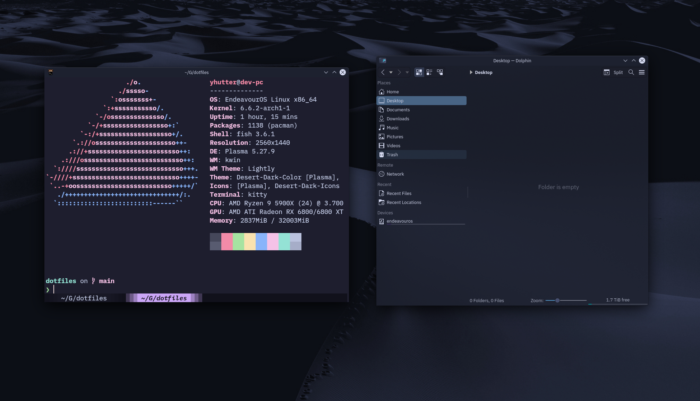

# My Linux Dotfiles
<h3 align="center">
	
    <br/>
    <br/>
    <p>Desktop powered by <a href="https://github.com/L4ki/Desert-Plasma-Themes" target="_blank">Desert Plasma Theme</a> Color Theme powered by <a href="https://github.com/catppuccin" target="_blank">Catppuccin</a></p>
</h3>

<p align="center">
    <br/>
	<a href="https://github.com/yhutter/dotfiles/stargazers">
		</a>
	<a href="https://github.com/yhutter/dotfiles/issues">
		</a>
    <br/>
	
</p>

## Setup


### Install necessary packages
My current Linux setup consists of EndeavourOS with the KDE Desktop and the awesome Desert Plasma Theme by [L4ki](https://github.com/L4ki/Desert-Plasma-Themes) in combination with the [Lightly Theme](https://github.com/Luwx/Lightly) for Window Decorations.
Beesides this basic setup I use the following packages:
|Package|Usage|
|-------|-----|
| plasma-wayland-session| Activates the Wayland Session for KDE|
| lightly-qt| Lightly Theme for KDE|
| xdg-desktop-portal-kde| Desktop Portal for KDE in order to Screen Share etc.|
| IBM Plex Mono, Jetbrains Mono Nerd Font and Noto Fonts Emoji | Some fonts I love to use |
| Kitty | Terminal |
| Neovim | Text Editor and Development Environment |
| Feh | Useful utility for viewing images |
| Gitui | Git Terminal Client |
| Fish | Shell |
| Zoxide | An improved version of the `z` command - Useful for quick directory navigation |
| Ripgrep | An improved version of the `grep` command - Useful for finding files quickly |
| Fzf | A fuzzy file finder |
| Bat | A better alternative for the `cat` command |
| starship | A crossplattform shell prompt |
| gitui | A terminal based git client |
| kvantum | An SVG Based Theme Engine for KDE which also makes blur working under Wayland |
| firefox-developer-edition | My browser of choice |

Most of these packages are available from the standard repository and can be
installed via pacman:

```bash
sudo pacman -S ripgrep ttf-ibm-plex ttf-jetbrains-mono-nerd noto-fonts-emoji gitui fish zoxide fzf bat feh kitty kvantum gitui firefox-developer-edition
```

Some of the packages need to be installed from the AUR (Arch User Repository):
```bash
yay -S lightly-qt
```

### Enable fish shell and install required plugins
I use the fish shell as my primary Linux shell in order to set it as the default simply run the following commands:
```bash
chsh -s /usr/bin/fish
sudo chsh -s /usr/bin/fish
```
Furthermore make sure to install the awesome `fisher package manager`:
```bash
curl -sL https://raw.githubusercontent.com/jorgebucaran/fisher/main/functions/fisher.fish | source && fisher install jorgebucaran/fisher
```
For the `zoxide` command to work in the fish shell you need to install a plugin:
```bash
plug install kidonng/zoxide.fish
```

### Install Starship Prompt
As my shell prompt I use starship, in order to install it simply run the following command:
```bash
curl -sS https://starship.rs/install.sh | sh
```

### Dark Desert Theme 
As I am a big fan of the Dark Desert Theme by L4ki. You can simply install it from the `Global Themes` in KDE. You need to search for `Desert-Global`
After that change your SDDM Login, Lock Screen and Global Theme to Dark Desert.

I noticed that Window Animations are a bit laggy under Wayland when using the Dark Desert Theme Window Decorations. I changed my Window Decorations to `Lightly` which works pretty good.
Also I love a nice blur effect so I selected the Desert-Kvantum Theme in the `Kvantum-Manager`. You can find the Kvantum Theme by simply cloning the [Desert Plasma Themes Repo](https://github.com/L4ki/Desert-Plasma-Themes) and importing it.

For my main font I use `IBM Plex`.

### Neovim
As my primary editor and IDE I use `Neovim` with a bunch of plugins such as `telescope`, `harpoon` etc. In order to correctly install these plugins please make sure that some sort of `Plugin Manager` is installed. In my case I use `Packer`.

#### Install Packer 
To install Packer run the following command:
```bash
git clone --depth 1 https://github.com/wbthomason/packer.nvim\
 ~/.local/share/nvim/site/pack/packer/start/packer.nvim
```
#### Source the packer file and install required plugins
With Packer installed you just need to open the file `~/.config/nvim/yhutter/packer.lua` and `source` it. To do that open the File with `nvim` and then press `:` and type `so`. After that pres `:` again and type `PackerSync`.

### Symlink config files
I like to symlink my config files with my cloned GitRepo so that I only need to change the files in the GitRepo. For this simply execute the following command below.
> Note that you should be inside this GitRepo
```bash
cp -rsf .config ~/.config/
```
## :nerd_face: Some other points to consider

### Reduce shutdown and reboot times
In order to speed up shutdown and reboot times edit the
`/etc/systemd/system.conf` file and set the `DefaultTimeoutStopSec` to 5 seconds
(or any value of your chosing):
```bash
...
DefaultTimeoutStopSec=5s
...
```
### Function Keys not working on Keyboard
I have a IQUNIX F96 Keyboard and for some reason the Function Keys were not
working properly. The reason seems to be that the FN Functionality gets
disabled. In order to enable it again create the file
`/etc/modprobe.d/hid_apple.conf` with the following content:
```bash
options hid_apple fnmode=2
```
After that create the file `/etc/dracut.conf.d/hid_apple.conf` with the following content
```bash
install_items+=/etc/modprobe.d/hid_apple.conf
```
Lastly regenerate the configuration for dracut with the `sudo dracut --force` command.

## :clap: Acknowledgments
Without these really useful ressources I would have struggled quite a bit. So a **BIG THANK YOU** to all those awesome ressources listed below.
| Link | Description |
| -----|-------------|
| [Catppuccin Repository](https://github.com/catppuccin) | For providing an awesome color theme for a plethora of applications |
| [Dark Desert Theme](https://github.com/L4ki/Desert-Plasma-Themes) | For creating a truly awesome dark theme with Blur |
| [Arch Wiki](https://wiki.archlinux.org/) | For giving useful tipps and tricks to anything Arch related |
| [EndeavourOS](https://endeavouros.com/) | For creating a solid and yet minimalistic Linux Distro based on Arch |
| [Neovim Setup Tutorial from ThePrimeagen](https://www.youtube.com/watch?v=w7i4amO_zaE) | For creating an easy to understand beginner tutorial for a custom Neovim Setup |
