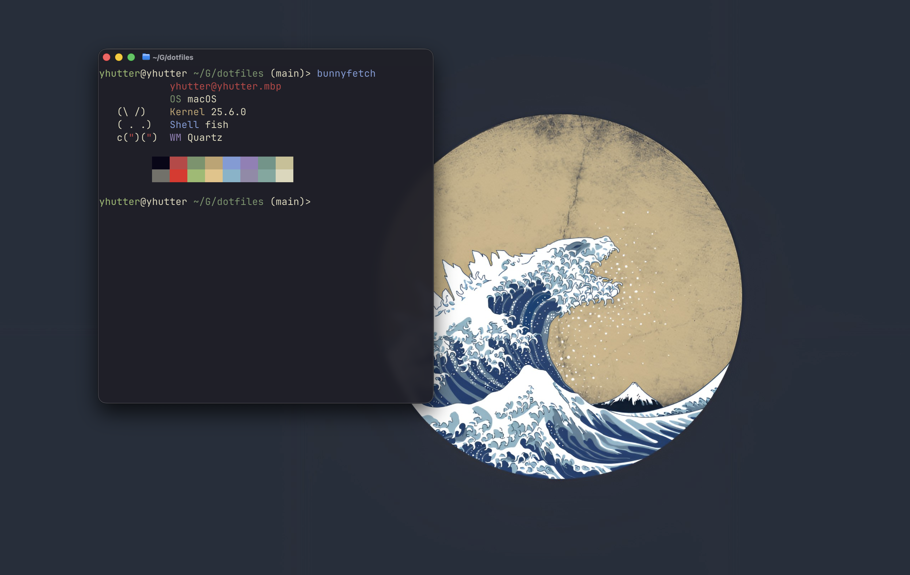

<div class="center">
    <h1>dotfiles</h1>
    
</div>

## Command Line Tools

> Please note that for this setup assumes that you have [Homebrew](https://brew.sh/) installed on MacOS. For other operating systems use your dedicated package manager to install these packages.

```bash
brew install fish # Shell
brew install rg # Ripgrep
brew install neovim # Text Editor
brew install bat # Improved version of cat command
brew install zoxide # Improved version of cd that remembers your visited directories
brew install fzf # Fuzzy File Finder
brew install --cask font-jetbrains-mono-nerd-font
```
## Tools
- `Neovim` for quick text edits
- `Rider` for coding

## Wallpaper
The wallpaper can be found [here](https://unsplash.com/photos/snow-capped-mountain-reflected-in-lake-ptmMPW2-93o)

## Setup
- Copy the folders into `$HOME/.config` 


